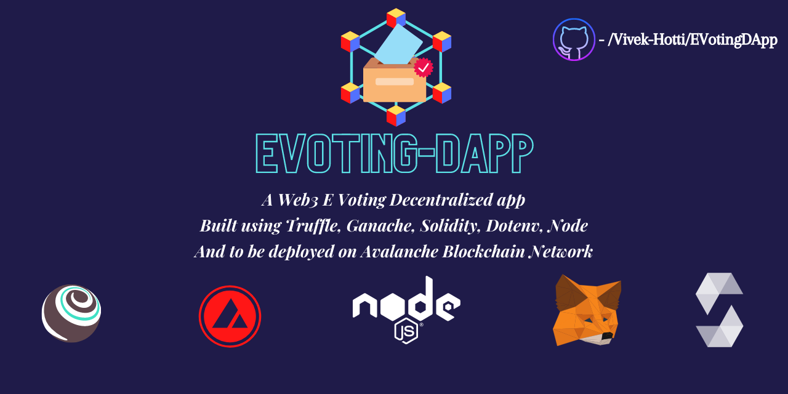

 

# EVOTING-DAPP
A Web3 E Voting Decentralized app built using Truffle, Ganache, Solidity, Dotenv, Node and to be deployed on Avalanche Blockchain Network. <br/>

<!--   -->

### ➤ Project structure :
```
📁EVOTINGDAPP
└─📁build/contracts         
  ├─📄Election.json          
  ├─📄MainContract.json      
  └─📄Migrations.json      
└─📁contracts            
  ├─ ⧫ Election.sol      
  ├─ ⧫ MainContract.sol      
  └─ ⧫ Migrations.sol      
└─📁migrations             
  ├─📄1_initial_migration.js      
  └─📄2_deploy_contracts.js      
├─📁node_modules            
└─📁src            
  ├─📄Election.js      
  ├─📄index.css      
  ├─📄index.html      
  ├─📄index.js      
  ├─📄loadBlockchain.js     
  ├─📄loadElection.js     
  └─📄server.js      
├─📁test            
└─📄truffle-config.js         

```
### ➤ Project Requirements & Initial Setup:
To run this project on your local environment, you will have to:
- First, Install NodeJS (v8.9.4 or later)
- Then install Truffle :
    ```
    npm install -g truffle
    ```
    & create a truffle boilerplate using:
    ```
    truffle init
    ```
- Then install Metamask wallet chrome extension from [here](https://metamask.io/).
- Then install express dotenv using:
  ```
  npm install express dotenv @truffle/hdwallet-provider --save
  ```
- Lastly install Trufflesuite or Ganache GUI using the link [here](https://www.trufflesuite.com/ganache).

### ➤ Deployment of Smart Contracts :
- ***STEP 1*** : Open Ganache GUI & select Quickstart Ethereum. This creates you a dummy wallet with faucet (dummy) ethereum that helps you get your Smart Contracts deployed without the need of you to using Actual realtime ethereum. <br />
- ***STEP 2*** : Go to settings using the icon on the top right. Then add the path of your **truffle-config.js** that was created when you hit the command truffle init. Then it save and restart <br/>
- ***STEP 3*** : Open a linux based terminal and navigate to the root directory of where your project / truffle-config.js exists. Then run the command:
   ```
   truffle migrate --reset 
   ```
   This command starts to compile your smart contracts first and deploy them next.
   If all goes well, except for compilation warnings that can be ignored, you will recieve this output:
   
   The same can be verified by seeing the Ganache GUI, where the exact ETH amount is deducted from your first wallet:
   
   A further summary of the transactions occured and faucets (dummy-Eth) spent in deploying your contracts can be seen in the **"Transactions"** section of the Ganache GUI:<br/>
   
- ***STEP 4*** : Now that the smart contracts are deployed successfully, we need to now start to interact with the deployed contracts. To do that its time for deploying our frontend on our localhost server at 3000. Do not get confused, our smart contracts are up and running on the 7545 port, whereas our frontend will now be hosted on our 3000 port. To do this, we will first have to setup our metamask account and change the existing RPC for localhost from 8545 to 7545, as all our smart contracts on are deployed on the 7545 port. Then navigate to your **SRC** directory thast exists in your root directory and run the command:
   ```
   node server.js
   ```
   Then go to your browser where metamask has been setup and navigate to **localhost:3000**.
   And CONGRATULATIONS! Your own EVOTING DAPP is Up and Running!

### ➤ General flow of the Website :
<p align="center" width="100%">
    
</p>

### ➤ Up & Running on localhost using Fuji TestNet and AVAX Faucets :
<p align="center" width="100%">
    
</p>

<p align="center">
    <i>2021© Vivek Hotti. <br/>
    All Rights Reserved under the MIT Open Licence. <br/>
</p>


